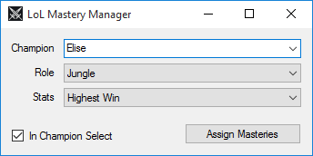

LoL Mastery Manager
===================

A tool for managing mastery pages in League of Legends. Inspired by [Championify](https://github.com/dustinblackman/Championify).

[See it in action!](https://raw.githubusercontent.com/maxdeviant/lol-mastery-manager/master/Example%201%20-%20Menu.gif)

Features
--------
- [x] Download mastery pages from [Champion.gg](http://champion.gg/)
- [x] Automatically assign mastery points based on selected champion and role
- [x] Works in the menus and during champion select
